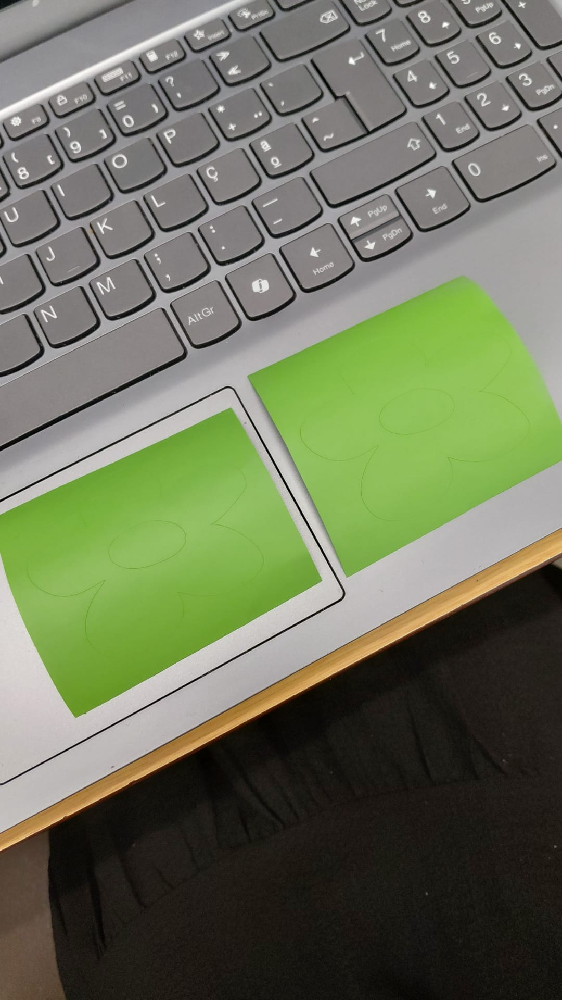

# Silhouette Cameo

> O corte vinil é uma técnica de recorte em um equipamento precisão para películas autoadesivas ou termocolantes, concebendo este a partir da aplicação Silhouette Studio e produzindo o projeto em no Adobe Illustrator.

**Tutorial 101:**
Modelo: Silhouette Cameo 
Data: 20/05/2026
O projeto de exemplo pertence e o tutorial foram desenvolvidos Matilde Pita

## 1. Como desenhar para esta tecnologia?

Para esta tecnologia é preciso usar programas de ilustração que permitam criar ou vetorizar imagens, como o Adobe Illustrator.

## 2. Como preparar um ficheiro para a máquina

Para utilizar o ficheiro na plotter exige importar a sua arte ou vetor, configurar o formato da página de acordo com a máquina e definir as linhas de corte.

- Software: Adobe Illustrator, Silhouette Studio
- Formatos de ficheiro: .STUDIO, .STUDIO3, .GSD, .GST, .SVG, .DXF, .PNG, .JPG, .JPEG, .BMP, .GIF, .TIFF, .PDF, .TTF, .OTF
- Settings principais: Importação de arte/vetor, Configuração do formato de página, Definição de linhas de corte

## 3. Antes de Começar

### 3.1. Segurança

A segurança numa máquina de corte de vinil (plotter) foca-se na prevenção de **cortes acidentais** com as lâminas e na **proteção elétrica/mecânica** do equipamento. 
**Proteção elétrica/mecânica** do equipamento. As regras essenciais incluem manter as mãos afastadas da área de corte em funcionamento, desligar a máquina para trocar a lâmina, e usar calçado fechado.

### 3.2. Que tipo de ficheiros vou usar e onde os posso produzir

Para preparar ficheiros para o programa Silhouette Studio, é preciso o ficheiro em questão estar nos formatos: 
.STUDIO, .STUDIO3, .GSD, .GST, .SVG, .DXF, .PNG, .JPG, .JPEG, .BMP, .GIF, .TIFF, .PDF, .TTF, .OTF

## 4. Como operar a máquina passo-a-passo

1. Depois de ligar a maquina é preciso preparar a base de corte, fixando o seu material em uso (película vinil neste contexto), alinhando com os clips da maquina, como vemos nas imagens abaixo.

2. Após alinhar a base de corte com a linha guia no lado esquerdo da máquina é só pressionar o botão para carregar/descarregar material (seta para cima/carregar) no painel da máquina e monitorizar o seu funcionamento.
.mp4)

3. **Remoção segura:** Quando a máquina terminar, é preciso pressionar o botão para descarregar o material (seta para baixo/ejetar) e quando a maquina soltar o vinil basta extrair e aproveitar o corte.

## 5. Resultado e pós-produção

Após o corte do vinil pode-se fazer mais camadas de cor com um vinil transparente que permita essa mistura entre materiais, ou fazer recorte do próprio vinil. 

## 6. Recursos e Ficheiros

- Ficheiros-modelo: `attachments/`
- Links externos:
- Vídeos de referência:
