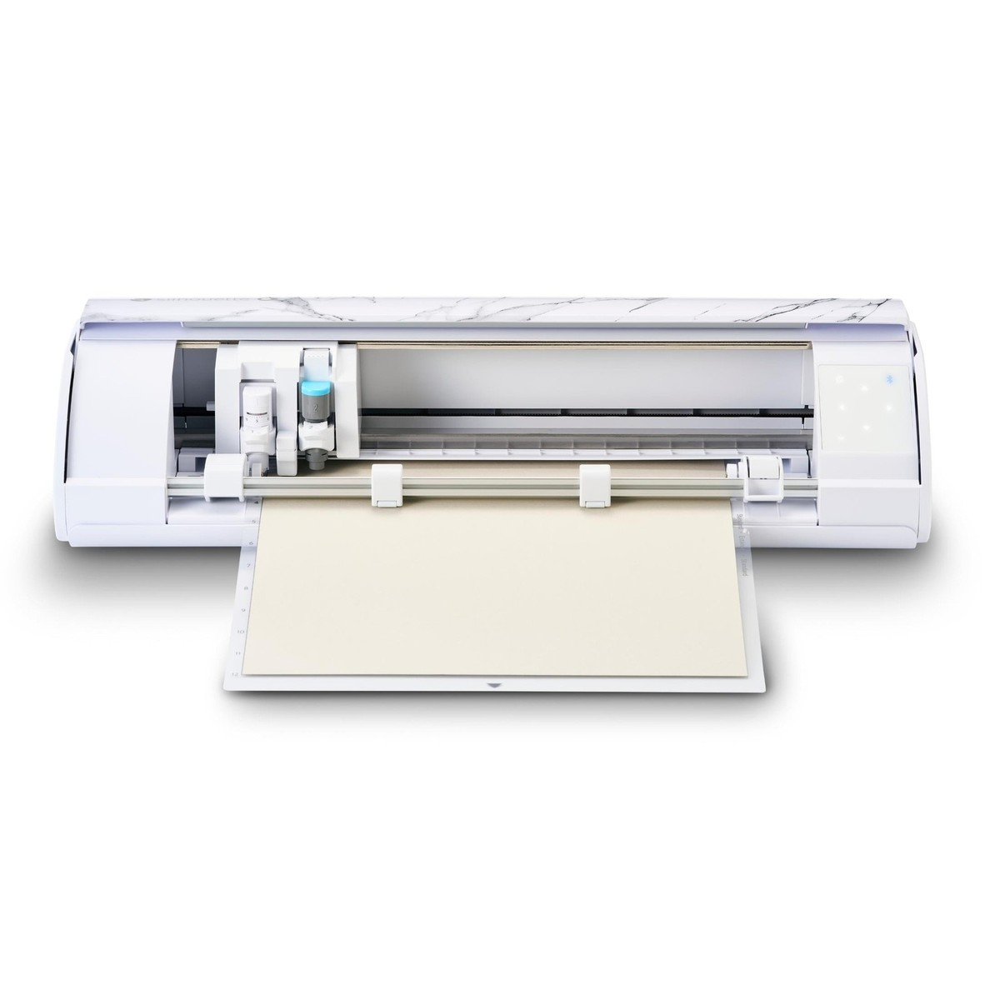
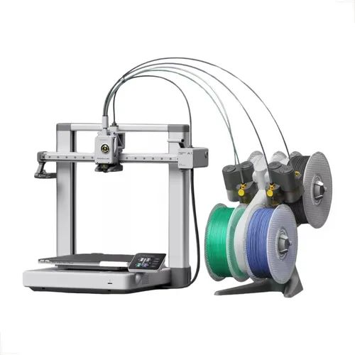

# Grupo 6 

> CNC É DO CARAL** MAS 3D É MELHOR.

## Elementos do Grupo

| Número  | Nome                |
| ------- | ------------------- |
| 2025252 | Maria Dias          |
| 2025285 | Matilde Pita        |
| 2025487 | Ana Marta Cerqueira |
| 2025316 | Mariana Mota        |

---

## Tutoriais de Máquinas

Cada grupo documenta **duas máquinas** com tutoriais detalhados. As páginas individuais de cada tutorial estão em [tutoriais/](tutoriais/).

<!-- Cada thumbnail liga ao tutorial. Cada tutorial vive em
     tutoriais/<nome-da-maquina>/index.md (renomear `_modelo`). -->

<!-- markdownlint-disable MD033 -->

  <a class="gallery-card" href="tutoriais/corte-de-vinil/">
    
    <h3>Corte de Vinil</h3>
    
Silhouette Cameo

  </a>

  <a class="gallery-card" href="tutoriais/impressao-3d/">
    
    <h3>Impressão 3D</h3>
    
Bambu Lab A1 mini

  </a>

<!-- markdownlint-enable MD033 -->

---

## Galeria de Experiências Individuais

Cada elemento do grupo desenvolveu um portfólio individual (**Projeto Integrado**, 50% da avaliação). As páginas individuais estão em [experiencias/](experiencias/).

<!-- Duplicar o bloco abaixo para cada elemento e substituir `_modelo` em
     ambos os caminhos por `<numero>-<nome>`. -->

<!-- markdownlint-disable MD033 -->

  <a class="gallery-card" href="experiencias/_modelo/">
    
    <h3>Nome do Projeto</h3>
    
Nome do Aluno

  </a>

<!-- markdownlint-enable MD033 -->
